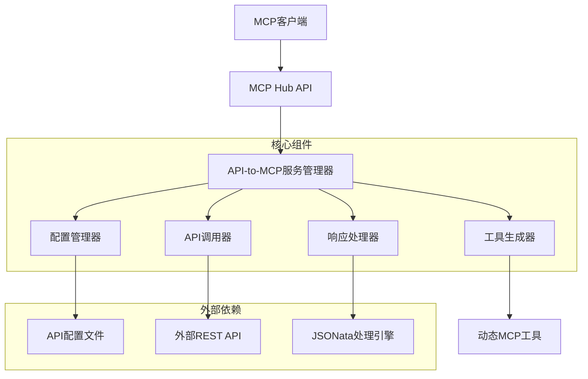
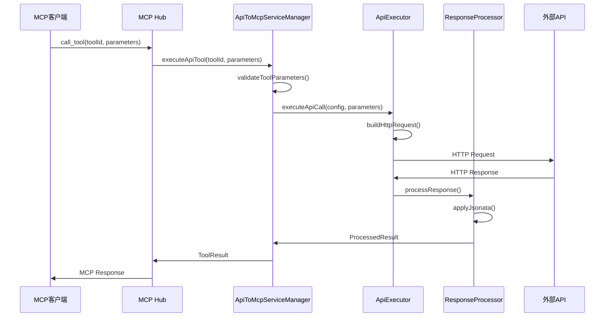
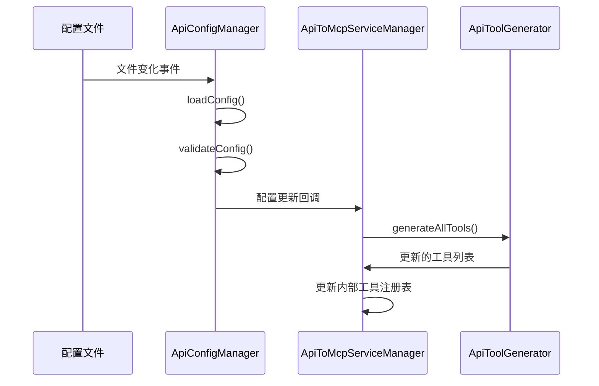

# 设计文档

## 概述

本设计文档描述了API接口转化为MCP服务功能的技术实现方案。该功能将允许用户通过配置文件定义REST API接口信息，系统自动将这些API转换为可通过MCP协议访问的工具，实现外部API与MCP生态的无缝集成。

### 核心目标
1. **灵活的API配置** - 支持复杂的API接口配置，包括认证、参数映射、响应处理
2. **动态工具生成** - 运行时根据配置生成MCP工具，无需重启服务
3. **强大的数据处理** - 使用JSONata进行响应数据转换和提取
4. **安全可靠** - 提供认证、访问控制和错误处理机制
5. **高性能** - 支持并发调用、连接复用和缓存机制

## 架构设计

### 1. 整体架构



### 2. 配置文件结构设计

#### API配置文件格式 (api-tools.json)
```json
{
  "version": "1.0",
  "tools": [
    {
      "id": "weather-api",
      "name": "获取天气信息",
      "description": "根据城市名称获取当前天气信息",
      "api": {
        "url": "https://api.weather.com/v1/current",
        "method": "GET",
        "headers": {
          "Authorization": "Bearer {{env.WEATHER_API_KEY}}",
          "Content-Type": "application/json"
        },
        "queryParams": {
          "city": "{{data.city}}",
          "units": "metric"
        },
        "timeout": 5000
      },
      "parameters": {
        "type": "object",
        "properties": {
          "city": {
            "type": "string",
            "description": "城市名称",
            "minLength": 1
          }
        },
        "required": ["city"]
      },
      "response": {
        "jsonata": "{ \"temperature\": current.temp_c, \"condition\": current.condition.text, \"humidity\": current.humidity }",
        "errorPath": "error.message"
      }
    }
  ]
}
```

### 3. 核心组件设计

#### ApiToMcpServiceManager
```typescript
interface ApiToMcpServiceManager {
  // 初始化服务管理器
  initialize(configPath: string): Promise<void>
  
  // 重新加载配置
  reloadConfig(): Promise<void>
  
  // 获取所有API生成的工具
  getApiTools(): Promise<McpTool[]>
  
  // 执行API工具调用
  executeApiTool(toolId: string, parameters: any): Promise<ToolResult>
  
  // 获取工具定义
  getToolDefinition(toolId: string): McpTool | undefined
  
  // 验证工具参数
  validateToolParameters(toolId: string, parameters: any): ValidationResult
}
```

#### ApiConfigManager
```typescript
interface ApiConfigManager {
  // 加载API配置文件
  loadConfig(configPath: string): Promise<ApiToolConfig[]>
  
  // 验证配置格式
  validateConfig(config: ApiToolConfig[]): ValidationResult
  
  // 监听配置文件变化
  watchConfigFile(callback: (config: ApiToolConfig[]) => void): void
  
  // 解析环境变量引用
  resolveEnvironmentVariables(config: ApiToolConfig): ApiToolConfig
}
```

#### ApiToolGenerator
```typescript
interface ApiToolGenerator {
  // 从API配置生成MCP工具定义
  generateMcpTool(apiConfig: ApiToolConfig): McpTool
  
  // 验证生成的工具定义
  validateGeneratedTool(tool: McpTool): ValidationResult
  
  // 批量生成工具
  generateAllTools(configs: ApiToolConfig[]): McpTool[]
}
```

#### ApiExecutor
```typescript
interface ApiExecutor {
  // 执行API调用
  executeApiCall(config: ApiToolConfig, parameters: any): Promise<ApiResponse>
  
  // 构建HTTP请求
  buildHttpRequest(config: ApiToolConfig, parameters: any): HttpRequest
  
  // 处理认证
  applyAuthentication(request: HttpRequest, authConfig: AuthConfig): HttpRequest
  
  // 处理超时和重试
  handleTimeoutAndRetry(request: HttpRequest): Promise<HttpResponse>
}
```

#### ResponseProcessor
```typescript
interface ResponseProcessor {
  // 使用JSONata处理响应
  processWithJsonata(response: any, jsonataExpression: string): Promise<any>
  
  // 处理错误响应
  processErrorResponse(response: HttpResponse, errorPath?: string): McpError
  
  // 验证JSONata表达式
  validateJsonataExpression(expression: string): ValidationResult
}
```

## 组件和接口

### 1. 数据模型

#### ApiToolConfig
```typescript
interface ApiToolConfig {
  id: string                    // 工具唯一标识
  name: string                  // 工具显示名称
  description: string           // 工具描述
  api: ApiEndpointConfig        // API端点配置
  parameters: JsonSchema        // 参数JSON Schema
  response: ResponseConfig      // 响应处理配置
  security?: SecurityConfig     // 安全配置
  cache?: CacheConfig          // 缓存配置
}

interface ApiEndpointConfig {
  url: string                   // API URL，支持模板变量
  method: HttpMethod            // HTTP方法
  headers?: Record<string, string>  // 请求头，支持模板变量
  queryParams?: Record<string, string>  // 查询参数
  body?: string | object        // 请求体模板
  timeout?: number              // 超时时间（毫秒）
  retries?: number              // 重试次数
}

interface ResponseConfig {
  jsonata?: string              // JSONata表达式
  errorPath?: string            // 错误信息提取路径
  successCondition?: string     // 成功条件判断
}

interface SecurityConfig {
  authentication?: AuthConfig   // 认证配置
  allowedDomains?: string[]     // 允许的域名白名单
  rateLimiting?: RateLimitConfig // 频率限制
}

interface AuthConfig {
  type: 'bearer' | 'apikey' | 'basic'
  token?: string                // Bearer token或API key
  header?: string               // API key的header名称
  username?: string             // Basic auth用户名
  password?: string             // Basic auth密码
}
```

#### TemplateEngine
```typescript
interface TemplateEngine {
  // 渲染模板字符串
  render(template: string, data: any): string
  
  // 验证模板语法
  validateTemplate(template: string): ValidationResult
  
  // 提取模板中的变量
  extractVariables(template: string): string[]
}
```

### 2. HTTP客户端设计

#### HttpClient
```typescript
interface HttpClient {
  // 执行HTTP请求
  request(config: HttpRequestConfig): Promise<HttpResponse>
  
  // 设置默认配置
  setDefaults(config: Partial<HttpRequestConfig>): void
  
  // 添加请求拦截器
  addRequestInterceptor(interceptor: RequestInterceptor): void
  
  // 添加响应拦截器
  addResponseInterceptor(interceptor: ResponseInterceptor): void
}

interface HttpRequestConfig {
  url: string
  method: HttpMethod
  headers?: Record<string, string>
  params?: Record<string, any>
  data?: any
  timeout?: number
  retries?: number
}

interface HttpResponse {
  status: number
  statusText: string
  headers: Record<string, string>
  data: any
  config: HttpRequestConfig
}
```

### 3. 缓存系统设计

#### CacheManager
```typescript
interface CacheManager {
  // 获取缓存
  get(key: string): Promise<any | null>
  
  // 设置缓存
  set(key: string, value: any, ttl?: number): Promise<void>
  
  // 删除缓存
  delete(key: string): Promise<void>
  
  // 清空缓存
  clear(): Promise<void>
  
  // 生成缓存键
  generateCacheKey(toolId: string, parameters: any): string
}

interface CacheConfig {
  enabled: boolean
  ttl: number                   // 生存时间（秒）
  maxSize?: number              // 最大缓存条目数
  keyGenerator?: (toolId: string, params: any) => string
}
```

## 数据流设计

### 1. 工具调用流程



### 2. 配置加载和热重载流程



## 错误处理

### 1. 错误类型定义

```typescript
enum ApiToMcpErrorCode {
  // 配置相关错误
  CONFIG_FILE_NOT_FOUND = 'CONFIG_FILE_NOT_FOUND',
  INVALID_CONFIG_FORMAT = 'INVALID_CONFIG_FORMAT',
  INVALID_JSONATA_EXPRESSION = 'INVALID_JSONATA_EXPRESSION',
  
  // API调用错误
  API_REQUEST_FAILED = 'API_REQUEST_FAILED',
  API_TIMEOUT = 'API_TIMEOUT',
  API_AUTHENTICATION_FAILED = 'API_AUTHENTICATION_FAILED',
  
  // 参数验证错误
  INVALID_TOOL_PARAMETERS = 'INVALID_TOOL_PARAMETERS',
  MISSING_REQUIRED_PARAMETER = 'MISSING_REQUIRED_PARAMETER',
  
  // 响应处理错误
  RESPONSE_PROCESSING_FAILED = 'RESPONSE_PROCESSING_FAILED',
  JSONATA_EXECUTION_ERROR = 'JSONATA_EXECUTION_ERROR',
  
  // 安全相关错误
  DOMAIN_NOT_ALLOWED = 'DOMAIN_NOT_ALLOWED',
  RATE_LIMIT_EXCEEDED = 'RATE_LIMIT_EXCEEDED'
}
```

### 2. 错误处理策略

#### 配置错误处理
- 配置文件格式错误：提供详细的错误位置和修复建议
- JSONata语法错误：在配置加载时验证并报告错误
- 参数schema错误：验证JSON Schema格式的正确性

#### API调用错误处理
- 网络错误：支持重试机制和降级处理
- 认证失败：记录错误日志并返回明确的错误信息
- 超时处理：可配置的超时时间和重试策略

#### 响应处理错误
- JSONata执行错误：返回原始响应和错误信息
- 数据转换失败：提供详细的错误上下文

### 3. 错误恢复机制

```typescript
interface ErrorRecoveryStrategy {
  // 判断是否可以重试
  canRetry(error: ApiToMcpError): boolean
  
  // 计算重试延迟
  calculateRetryDelay(attempt: number): number
  
  // 执行降级处理
  fallback(error: ApiToMcpError, context: any): Promise<any>
}
```

## 安全设计

### 1. 认证和授权

#### 支持的认证方式
```typescript
interface AuthenticationStrategy {
  // Bearer Token认证
  bearerToken(token: string): AuthConfig
  
  // API Key认证
  apiKey(key: string, header: string): AuthConfig
  
  // Basic认证
  basicAuth(username: string, password: string): AuthConfig
  
  // 自定义认证
  custom(headers: Record<string, string>): AuthConfig
}
```

#### 环境变量支持
- 支持 `{{env.VARIABLE_NAME}}` 语法引用环境变量
- 避免在配置文件中明文存储敏感信息
- 启动时验证必需的环境变量

### 2. 访问控制

#### 域名白名单
```typescript
interface DomainWhitelist {
  // 验证URL是否在白名单中
  isAllowed(url: string): boolean
  
  // 添加允许的域名
  addDomain(domain: string): void
  
  // 移除域名
  removeDomain(domain: string): void
}
```

#### 频率限制
```typescript
interface RateLimiter {
  // 检查是否超过频率限制
  checkLimit(toolId: string, clientId?: string): Promise<boolean>
  
  // 记录API调用
  recordCall(toolId: string, clientId?: string): Promise<void>
  
  // 重置计数器
  resetCounter(toolId: string, clientId?: string): Promise<void>
}
```

### 3. 日志和审计

#### 安全日志记录
```typescript
interface SecurityLogger {
  // 记录API调用
  logApiCall(toolId: string, parameters: any, response: any): void
  
  // 记录认证失败
  logAuthFailure(toolId: string, error: Error): void
  
  // 记录访问被拒绝
  logAccessDenied(toolId: string, reason: string): void
  
  // 记录异常活动
  logSuspiciousActivity(event: SecurityEvent): void
}
```

## 性能优化

### 1. 连接池管理

```typescript
interface ConnectionPool {
  // 获取连接
  getConnection(host: string): Promise<HttpConnection>
  
  // 释放连接
  releaseConnection(connection: HttpConnection): void
  
  // 设置池大小
  setPoolSize(size: number): void
  
  // 清理空闲连接
  cleanupIdleConnections(): void
}
```

### 2. 缓存策略

#### 多级缓存设计
- **L1缓存**: 内存缓存，用于频繁访问的数据
- **L2缓存**: 可选的Redis缓存，用于跨实例共享
- **缓存键策略**: 基于工具ID和参数哈希生成唯一键

#### 缓存失效策略
```typescript
interface CacheInvalidationStrategy {
  // 基于TTL的自动失效
  ttlBased(ttl: number): CacheStrategy
  
  // 基于版本的失效
  versionBased(version: string): CacheStrategy
  
  // 手动失效
  manual(): CacheStrategy
}
```

### 3. 性能监控

#### 性能指标收集
```typescript
interface PerformanceMetrics {
  // API调用延迟
  apiCallLatency: Histogram
  
  // 成功率
  successRate: Counter
  
  // 错误率
  errorRate: Counter
  
  // 缓存命中率
  cacheHitRate: Gauge
  
  // 并发连接数
  concurrentConnections: Gauge
}
```

## 测试策略

### 1. 单元测试

#### 测试覆盖范围
- **配置管理**: 配置加载、验证、环境变量解析
- **模板引擎**: 参数替换、模板验证
- **HTTP客户端**: 请求构建、认证、重试机制
- **响应处理**: JSONata执行、错误处理
- **缓存系统**: 缓存操作、失效策略

#### 测试工具和框架
```typescript
describe('ApiToMcpServiceManager', () => {
  it('应该正确加载和验证API配置')
  it('应该生成有效的MCP工具定义')
  it('应该正确执行API调用和参数替换')
  it('应该使用JSONata正确处理响应')
  it('应该处理API调用错误和超时')
  it('应该支持配置热重载')
})
```

### 2. 集成测试

#### 测试场景
- **端到端API调用**: 从MCP客户端到外部API的完整流程
- **配置热重载**: 配置文件变化时的系统行为
- **错误恢复**: 各种错误场景下的系统恢复能力
- **性能测试**: 并发调用和缓存效果

#### Mock服务设计
```typescript
interface MockApiServer {
  // 启动Mock服务器
  start(port: number): Promise<void>
  
  // 配置API端点
  setupEndpoint(path: string, response: any): void
  
  // 模拟错误响应
  simulateError(path: string, error: HttpError): void
  
  // 记录请求日志
  getRequestLogs(): RequestLog[]
}
```

### 3. 性能测试

#### 负载测试场景
- **并发API调用**: 测试系统在高并发下的表现
- **缓存效果**: 验证缓存对性能的提升
- **内存使用**: 监控长时间运行的内存泄漏
- **连接池效率**: 验证连接复用的效果

## 部署和运维

### 1. 配置管理

#### 配置文件结构
```
config/
├── api-tools.json          # API工具配置
├── api-tools.schema.json   # 配置文件JSON Schema
└── examples/               # 配置示例
    ├── weather-api.json
    ├── translation-api.json
    └── database-api.json
```

#### 配置验证工具
```bash
# 验证配置文件格式
mcp-hub validate-config --file config/api-tools.json

# 测试API连接
mcp-hub test-api --tool-id weather-api --dry-run

# 生成配置模板
mcp-hub generate-config --template weather-api
```

### 2. 监控和日志

#### 日志格式
```json
{
  "timestamp": "2024-01-01T12:00:00Z",
  "level": "info",
  "component": "api-to-mcp",
  "toolId": "weather-api",
  "action": "api_call",
  "duration": 150,
  "status": "success",
  "parameters": {"city": "Beijing"},
  "response_size": 1024
}
```

#### 监控指标
- API调用成功率和延迟
- 缓存命中率
- 错误率和错误类型分布
- 系统资源使用情况

### 3. 故障排除

#### 常见问题诊断
```typescript
interface DiagnosticTool {
  // 检查配置文件
  checkConfig(): DiagnosticResult
  
  // 测试API连接
  testApiConnectivity(toolId: string): DiagnosticResult
  
  // 验证JSONata表达式
  validateJsonata(expression: string, sampleData: any): DiagnosticResult
  
  // 检查系统健康状态
  healthCheck(): HealthStatus
}
```

## 扩展性设计

### 1. 插件系统

#### 自定义认证插件
```typescript
interface AuthenticationPlugin {
  name: string
  authenticate(config: any): Promise<AuthHeaders>
  validateConfig(config: any): ValidationResult
}
```

#### 自定义响应处理插件
```typescript
interface ResponseProcessorPlugin {
  name: string
  process(response: any, config: any): Promise<any>
  validateConfig(config: any): ValidationResult
}
```

### 2. 协议扩展

#### 支持其他协议
- GraphQL API支持
- gRPC API支持
- WebSocket API支持
- 数据库查询支持

### 3. 配置格式扩展

#### 支持多种配置格式
- YAML格式配置
- TOML格式配置
- 环境变量配置
- 远程配置中心集成