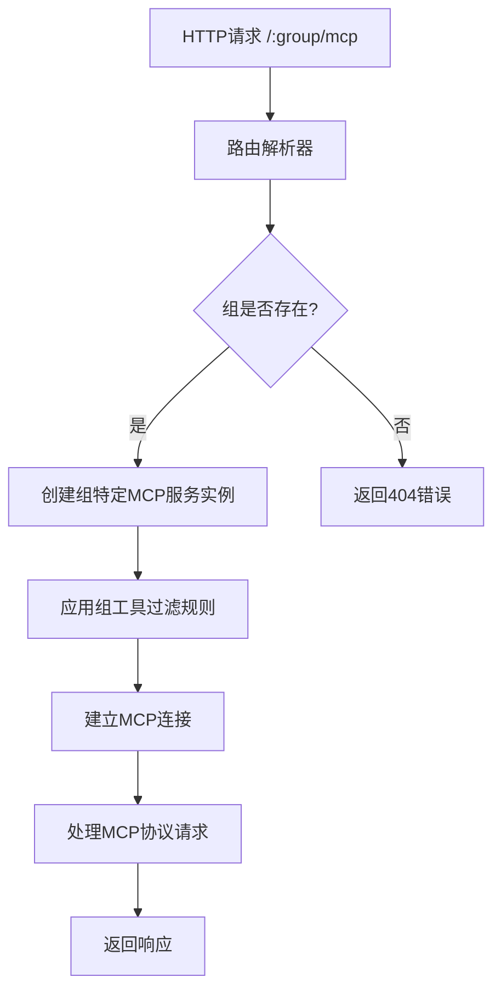
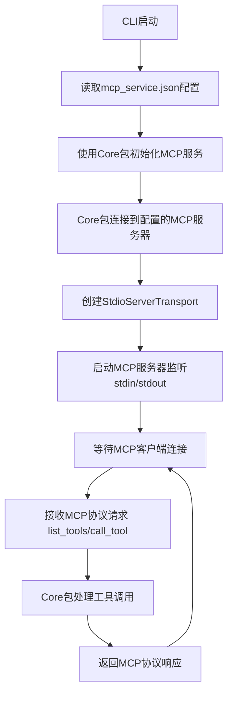

# Design Document

## Overview

本设计文档描述了MCP Hub项目的三个主要增强功能的技术实现方案。这些增强功能将显著提升系统的灵活性、可用性和代码质量，同时保持向后兼容性。

### 核心目标
1. **基于组的路由系统** - 实现 `/:group/mcp` 路径的组特定MCP服务访问
2. **核心逻辑抽取** - 创建 `@mcp-core/mcp-hub-core` 共享包，包含MCP服务注册和调用逻辑
3. **独立CLI包** - 开发 `@mcp-core/mcp-hub-cli` 用于命令行MCP服务聚合
4. **代码重构优化** - 改善模块结构、提升测试覆盖率和代码质量

## Architecture

### 1. 基于组的MCP服务路由架构

#### 路由层设计
```
现有架构:
/mcp -> 全局MCP服务 (保留用于管理)

新增架构:
/:group/mcp -> 组特定MCP服务
/api/groups -> 组管理API
```

#### 组路由处理流程


#### 组服务隔离设计
- 每个组维护独立的MCP服务实例
- 组间工具访问完全隔离
- 共享底层服务器连接池以优化资源使用

### 2. 核心包架构设计

#### 包重新组织
```
packages/
├── core/                 # @mcp-core/mcp-hub-core (新增)
│   ├── src/
│   │   ├── services/     # MCP服务管理
│   │   ├── server/       # 服务器连接管理
│   │   ├── tools/        # 工具管理
│   │   ├── config/       # 配置处理
│   │   └── types/        # 核心类型定义
│   └── package.json
├── cli/                  # @mcp-core/mcp-hub-cli (新增)
│   ├── src/
│   │   ├── server/       # MCP服务器实现
│   │   ├── config/       # CLI特定配置
│   │   ├── transport/    # 传输层实现
│   │   └── index.ts      # CLI入口点
│   ├── bin/              # 可执行文件
│   └── package.json
└── share/                # @mcp-core/mcp-hub-share (现有)
    └── src/
        ├── config.d.ts   # 配置类型
        ├── mcp.d.ts      # MCP类型
        └── types.d.ts    # 通用类型
```

#### 核心包功能分离
- **@mcp-core/mcp-hub-core**: MCP服务注册、连接管理、工具调用核心逻辑
- **@mcp-core/mcp-hub-api**: Web API、组管理、HTTP路由 (现有backend重构)
- **@mcp-core/mcp-hub-cli**: 命令行界面、CLI特定配置和输出
- **@mcp-core/mcp-hub-share**: 共享类型定义和接口

#### 核心包组件 (@mcp-core/mcp-hub-core)
1. **McpServiceManager** - MCP服务注册和生命周期管理
2. **ServerConnectionManager** - MCP服务器连接池管理
3. **ToolRegistry** - 工具注册和调用管理
4. **ConfigProcessor** - mcp_service.json配置处理

#### CLI包组件 (@mcp-core/mcp-hub-cli)
1. **CliMcpServer** - CLI模式的MCP服务器实现
2. **CliConfigManager** - CLI配置文件管理
3. **CliTransport** - CLI的MCP传输层实现
4. **CliLogger** - CLI专用日志系统

#### CLI作为MCP服务聚合器的工作流程


#### 包依赖关系
```mermaid
graph TD
    A[@mcp-core/mcp-hub-share] --> B[@mcp-core/mcp-hub-core]
    A --> C[@mcp-core/mcp-hub-api]
    A --> D[@mcp-core/mcp-hub-cli]
    B --> C
    B --> D
```

### 3. 代码重构架构

#### API包重新组织 (@mcp-core/mcp-hub-api)
```
backend/src/
├── api/                 # API端点层
│   ├── mcp/             # MCP协议端点
│   ├── groups/          # 组管理端点
│   └── admin/           # 管理端点
├── services/            # API特定服务
│   ├── group/           # 组管理服务
│   ├── routing/         # 路由服务
│   └── auth/            # 认证服务
├── middleware/          # 中间件
│   ├── cors/            # CORS处理
│   ├── logging/         # 请求日志
│   └── validation/      # 请求验证
└── utils/               # API工具函数
    ├── response/        # 响应格式化
    └── error/           # 错误处理
```

#### 核心包组织 (@mcp-core/mcp-hub-core)
```
packages/core/src/
├── services/            # 核心服务
│   ├── mcp/             # MCP服务管理
│   ├── server/          # 服务器管理
│   └── tool/            # 工具管理
├── config/              # 配置处理
│   ├── loader/          # 配置加载
│   └── validator/       # 配置验证
├── connection/          # 连接管理
│   ├── pool/            # 连接池
│   └── transport/       # 传输层
└── types/               # 核心类型
    ├── service/         # 服务类型
    └── config/          # 配置类型
```

## Components and Interfaces

### 1. 组路由组件

#### GroupMcpRouter
```typescript
interface GroupMcpRouter {
  // 处理组特定的MCP请求
  handleGroupMcpRequest(groupId: string, request: McpRequest): Promise<McpResponse>
  
  // 验证组访问权限
  validateGroupAccess(groupId: string): boolean
  
  // 获取组的MCP服务实例
  getGroupMcpService(groupId: string): GroupMcpService
}
```

#### GroupMcpService
```typescript
interface GroupMcpService {
  // 初始化组特定的MCP服务
  initialize(groupConfig: GroupConfig): Promise<void>
  
  // 列出组可用工具
  listTools(): Promise<Tool[]>
  
  // 执行组内工具
  callTool(toolName: string, args: any): Promise<ToolResult>
  
  // 关闭服务
  shutdown(): Promise<void>
}
```

### 2. 核心包组件

#### McpServiceManager (核心包)
```typescript
interface McpServiceManager {
  // 从配置初始化MCP服务
  initializeFromConfig(config: McpServerConfig): Promise<void>
  
  // 注册MCP服务器
  registerServer(serverId: string, config: ServerConfig): Promise<void>
  
  // 获取所有可用工具
  getAllTools(): Promise<ToolInfo[]>
  
  // 执行工具调用
  executeToolCall(toolName: string, args: any, serverId?: string): Promise<ToolResult>
  
  // 获取服务状态
  getServiceStatus(): ServiceStatus
  
  // 关闭所有连接
  shutdown(): Promise<void>
}
```

#### CliMcpServer (CLI包)
```typescript
interface CliMcpServer {
  // 使用核心包初始化MCP服务聚合
  initialize(coreService: McpServiceManager): Promise<void>
  
  // 启动MCP服务器监听stdin/stdout
  start(): Promise<void>
  
  // 处理MCP协议的list_tools请求
  handleListTools(): Promise<Tool[]>
  
  // 处理MCP协议的call_tool请求
  handleCallTool(name: string, arguments: any): Promise<ToolResult>
  
  // 关闭服务器
  shutdown(): Promise<void>
}
```

#### CliConfigManager
```typescript
interface CliConfigManager {
  // 加载配置文件
  loadConfig(path: string): Promise<CliConfig>
  
  // 验证配置
  validateConfig(config: CliConfig): ValidationResult
  
  // 生成默认配置
  generateDefaultConfig(): CliConfig
}
```

### 3. 重构后的核心接口

#### McpServiceFactory (核心包)
```typescript
interface McpServiceFactory {
  // 创建核心MCP服务管理器
  createCoreService(config: McpServerConfig): McpServiceManager
  
  // 为API创建组特定服务包装器
  createGroupServiceWrapper(coreService: McpServiceManager, groupConfig: GroupConfig): GroupMcpService
  
  // 为CLI创建聚合器
  createCliAggregator(coreService: McpServiceManager): CliMcpAggregator
}
```

#### SharedConfigProcessor (核心包)
```typescript
interface SharedConfigProcessor {
  // 处理mcp_service.json配置
  processMcpServerConfig(configPath: string): Promise<McpServerConfig>
  
  // 验证服务器配置
  validateServerConfig(config: ServerConfig): ValidationResult
  
  // 合并配置文件
  mergeConfigs(baseConfig: McpServerConfig, overrideConfig: Partial<McpServerConfig>): McpServerConfig
}
```

## Data Models

### 1. 组路由数据模型

#### GroupMcpRequest
```typescript
interface GroupMcpRequest {
  groupId: string
  mcpRequest: McpProtocolRequest
  metadata: {
    timestamp: number
    clientId?: string
    sessionId?: string
  }
}
```

#### GroupMcpResponse
```typescript
interface GroupMcpResponse {
  groupId: string
  mcpResponse: McpProtocolResponse
  metadata: {
    processingTime: number
    toolsUsed: string[]
    errors?: Error[]
  }
}
```

### 2. CLI数据模型

#### CliConfig
```typescript
interface CliConfig {
  servers: Record<string, ServerConfig>
  logging: {
    level: 'debug' | 'info' | 'warn' | 'error'
    file?: string
  }
  transport: {
    type: 'stdio'
    options?: {
      sessionIdGenerator?: () => string
    }
  }
}
```

#### CliToolResult
```typescript
interface CliToolResult {
  success: boolean
  data: any
  metadata: {
    executionTime: number
    serverId: string
    toolName: string
  }
  errors?: string[]
}
```

### 3. 重构后的数据模型

#### ServiceMetrics
```typescript
interface ServiceMetrics {
  requestCount: number
  errorCount: number
  averageResponseTime: number
  activeConnections: number
  toolUsageStats: Record<string, number>
}
```

## Error Handling

### 1. 组路由错误处理

#### 错误类型定义
```typescript
enum GroupMcpErrorCode {
  GROUP_NOT_FOUND = 'GROUP_NOT_FOUND',
  GROUP_ACCESS_DENIED = 'GROUP_ACCESS_DENIED',
  GROUP_SERVICE_UNAVAILABLE = 'GROUP_SERVICE_UNAVAILABLE',
  TOOL_NOT_AVAILABLE_IN_GROUP = 'TOOL_NOT_AVAILABLE_IN_GROUP'
}
```

#### 错误处理策略
- **组不存在**: 返回404状态码和详细错误信息
- **工具不可用**: 返回具体的工具可用性信息
- **服务不可用**: 提供降级服务或重试机制
- **权限错误**: 记录访问日志并返回适当的错误响应

### 2. CLI错误处理

#### CLI特定错误
```typescript
enum CliErrorCode {
  CONFIG_FILE_NOT_FOUND = 'CONFIG_FILE_NOT_FOUND',
  INVALID_CONFIG_FORMAT = 'INVALID_CONFIG_FORMAT',
  SERVER_CONNECTION_FAILED = 'SERVER_CONNECTION_FAILED',
  TOOL_EXECUTION_FAILED = 'TOOL_EXECUTION_FAILED'
}
```

#### MCP协议错误响应
- 返回标准MCP错误格式
- 提供详细的错误代码和消息
- 支持错误日志记录和调试

### 3. 统一错误处理框架

#### ErrorHandler接口
```typescript
interface ErrorHandler {
  handleError(error: Error, context: ErrorContext): ErrorResponse
  logError(error: Error, context: ErrorContext): void
  shouldRetry(error: Error): boolean
}
```

## Testing Strategy

### 1. 测试架构

#### 测试层次结构
```
tests/
├── unit/                # 单元测试
│   ├── services/        # 服务层测试
│   ├── utils/           # 工具函数测试
│   └── validation/      # 验证逻辑测试
├── integration/         # 集成测试
│   ├── api/             # API端点测试
│   ├── mcp/             # MCP协议测试
│   └── groups/          # 组功能测试
├── e2e/                 # 端到端测试
│   ├── scenarios/       # 测试场景
│   └── fixtures/        # 测试数据
└── performance/         # 性能测试
    ├── load/            # 负载测试
    └── stress/          # 压力测试
```

### 2. 测试覆盖率目标

#### 覆盖率要求
- **单元测试**: 90%以上代码覆盖率
- **集成测试**: 覆盖所有API端点和主要业务流程
- **端到端测试**: 覆盖关键用户场景

#### 测试工具栈
- **测试框架**: Vitest
- **断言库**: 内置Vitest断言
- **模拟库**: Vitest Mock
- **覆盖率工具**: c8 (内置于Vitest)

### 3. 测试策略

#### 组路由测试
```typescript
describe('GroupMcpRouter', () => {
  it('应该正确路由到指定组的MCP服务')
  it('应该在组不存在时返回404错误')
  it('应该正确应用组的工具过滤规则')
  it('应该隔离不同组之间的工具访问')
})
```

#### CLI测试
```typescript
describe('CliMcpServer', () => {
  it('应该正确加载和验证配置文件')
  it('应该成功连接到配置的MCP服务')
  it('应该正确处理MCP协议的list_tools请求')
  it('应该正确处理MCP协议的call_tool请求')
  it('应该处理服务连接失败的情况')
  it('应该返回标准MCP错误响应')
})
```

### 4. 测试数据管理

#### 测试配置
- 使用独立的测试配置文件
- 模拟MCP服务器用于测试
- 测试数据版本控制和清理策略

#### 持续集成
- 自动化测试执行
- 测试覆盖率报告
- 性能回归检测

## Performance Considerations

### 1. 组路由性能优化

#### 连接池管理
- 共享底层MCP服务器连接
- 连接复用和生命周期管理
- 连接池大小动态调整

#### 缓存策略
- 组配置缓存
- 工具列表缓存
- 响应结果缓存（适当场景）

### 2. CLI性能优化

#### 启动时间优化
- 延迟加载非必要模块
- 配置文件解析优化
- 并行初始化MCP连接

#### 内存使用优化
- 流式处理大型响应
- 及时释放不需要的资源
- 内存使用监控和告警

### 3. 整体性能监控

#### 性能指标
- 请求响应时间
- 内存使用情况
- CPU使用率
- 并发连接数

#### 性能测试
- 负载测试场景
- 压力测试边界
- 性能回归检测

## Security Considerations

### 1. 组访问控制

#### 访问权限验证
- 组级别的访问控制
- 工具级别的权限检查
- 请求来源验证

#### 安全日志
- 访问日志记录
- 异常访问检测
- 安全事件告警

### 2. CLI安全

#### 配置文件安全
- 敏感信息加密存储
- 配置文件权限检查
- 安全的默认配置

#### 执行环境安全
- 输入参数验证
- 命令注入防护
- 安全的错误信息显示

### 3. 通用安全措施

#### 输入验证
- 严格的参数验证
- SQL注入防护
- XSS攻击防护

#### 通信安全
- HTTPS强制使用
- 请求签名验证
- 速率限制

## Migration Strategy

### 1. 向后兼容性保证

#### API兼容性
- 保持现有 `/mcp` 端点完全兼容
- 现有配置文件格式支持
- 客户端代码无需修改

#### 数据迁移
- 现有配置自动迁移
- 数据格式平滑升级
- 回滚机制支持

### 2. 渐进式部署

#### 功能开关
- 新功能可选启用
- A/B测试支持
- 灰度发布机制

#### 监控和回滚
- 部署监控指标
- 自动回滚触发条件
- 手动回滚流程

### 3. 用户迁移指导

#### 文档更新
- 迁移指南文档
- 新功能使用示例
- 常见问题解答

#### 工具支持
- 配置迁移工具
- 兼容性检查工具
- 自动化迁移脚本