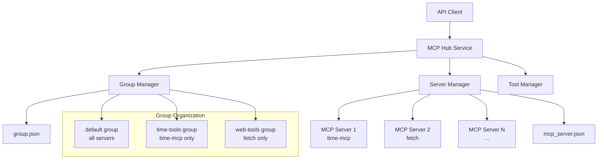
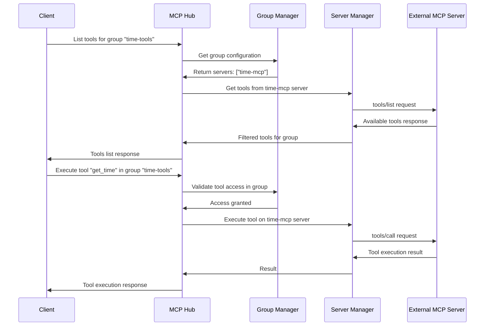

# Design Document

## Overview

The MCP Service Implementation will transform the current simple MCP server into a comprehensive hub that manages multiple external MCP servers, organizes them into groups, and provides unified access to their tools. The system will act as a proxy/aggregator, maintaining connections to multiple MCP servers and exposing their combined functionality through group-based access control.

## Architecture

### High-Level Architecture



### Component Interaction Flow



## Components and Interfaces

### 1. Server Manager (`ServerManager`)

**Responsibilities:**
- Initialize and manage connections to external MCP servers
- Handle server lifecycle (connect, disconnect, reconnect)
- Maintain server health status
- Execute tool calls on specific servers

**Interface:**
```typescript
interface ServerManager {
  initialize(): Promise<void>;
  getServerStatus(serverId: string): ServerStatus;
  getAllServers(): Map<string, ServerConnection>;
  executeToolOnServer(serverId: string, toolName: string, args: any): Promise<any>;
  getServerTools(serverId: string): Promise<Tool[]>;
  shutdown(): Promise<void>;
}

interface ServerConnection {
  id: string;
  config: ServerConfig;
  client: Client;
  status: ServerStatus;
  lastError?: Error;
  tools: Tool[];
}

enum ServerStatus {
  CONNECTING = 'connecting',
  CONNECTED = 'connected',
  DISCONNECTED = 'disconnected',
  ERROR = 'error'
}
```

### 2. Group Manager (`GroupManager`)

**Responsibilities:**
- Load and validate group configurations
- Resolve which servers belong to each group
- Filter tools based on group restrictions
- Validate tool access permissions

**Interface:**
```typescript
interface GroupManager {
  initialize(): Promise<void>;
  getGroup(groupId: string): Group | undefined;
  getAllGroups(): Map<string, Group>;
  getGroupTools(groupId: string): Promise<Tool[]>;
  validateToolAccess(groupId: string, toolName: string): boolean;
  getGroupServers(groupId: string): string[];
}

interface Group {
  id: string;
  name: string;
  description?: string;
  servers: string[];
  tools: string[];
  resolvedTools?: Tool[];
}
```

### 3. Tool Manager (`ToolManager`)

**Responsibilities:**
- Aggregate tools from multiple servers
- Apply group-based filtering
- Handle tool execution routing
- Manage tool schema validation

**Interface:**
```typescript
interface ToolManager {
  getToolsForGroup(groupId: string): Promise<Tool[]>;
  executeTool(groupId: string, toolName: string, args: any): Promise<ToolResult>;
  findToolServer(toolName: string, groupId: string): string | undefined;
  validateToolArgs(toolName: string, args: any): boolean;
}

interface Tool {
  name: string;
  description?: string;
  inputSchema: any;
  serverId: string;
}

interface ToolResult {
  content: any[];
  isError?: boolean;
}
```

### 4. Enhanced MCP Service (`McpHubService`)

**Responsibilities:**
- Coordinate between all managers
- Provide unified API interface
- Handle error aggregation and logging
- Manage service lifecycle

**Interface:**
```typescript
interface McpHubService {
  initialize(): Promise<void>;
  listTools(groupId?: string): Promise<Tool[]>;
  callTool(toolName: string, args: any, groupId?: string): Promise<ToolResult>;
  getGroupInfo(groupId: string): Group | undefined;
  getServerHealth(): Map<string, ServerStatus>;
  shutdown(): Promise<void>;
}
```

## Data Models

### Configuration Models

```typescript
// Extended from existing shared types
interface ServerConfig {
  type: 'stdio' | 'sse' | 'streaming';
  command?: string;
  args?: string[];
  url?: string;
  headers?: Record<string, string>;
  env?: Record<string, string>;
  enabled?: boolean;
}

interface GroupConfig {
  [groupName: string]: {
    id: string;
    name: string;
    description?: string;
    servers: string[];
    tools: string[];
  };
}
```

### Runtime Models

```typescript
interface ServerConnection {
  id: string;
  config: ServerConfig;
  client: Client;
  status: ServerStatus;
  lastConnected?: Date;
  lastError?: Error;
  tools: Tool[];
  reconnectAttempts: number;
}

interface GroupRuntime {
  config: Group;
  availableServers: string[];
  availableTools: Tool[];
  lastUpdated: Date;
}
```

## Error Handling

### Error Categories

1. **Configuration Errors**
   - Invalid server configurations
   - Missing group references
   - Schema validation failures

2. **Connection Errors**
   - Server startup failures
   - Network connectivity issues
   - Authentication failures

3. **Runtime Errors**
   - Tool execution failures
   - Server disconnections
   - Invalid tool arguments

### Error Handling Strategy

```typescript
interface ErrorHandler {
  handleServerError(serverId: string, error: Error): void;
  handleGroupError(groupId: string, error: Error): void;
  handleToolError(toolName: string, error: Error): ToolResult;
}

// Error response format
interface ErrorResponse {
  jsonrpc: "2.0";
  error: {
    code: number;
    message: string;
    data?: any;
  };
  id: string | number | null;
}
```

### Resilience Patterns

- **Circuit Breaker**: Temporarily disable failing servers
- **Retry Logic**: Automatic reconnection with exponential backoff
- **Graceful Degradation**: Continue operation with available servers
- **Health Checks**: Periodic server connectivity validation

## Testing Strategy

### Unit Testing

1. **Server Manager Tests**
   - Server connection establishment
   - Error handling and reconnection
   - Tool discovery and caching

2. **Group Manager Tests**
   - Configuration loading and validation
   - Group resolution logic
   - Tool filtering by group

3. **Tool Manager Tests**
   - Tool aggregation across servers
   - Execution routing
   - Argument validation

### Integration Testing

1. **End-to-End Workflows**
   - Complete tool discovery and execution flows
   - Group-based access control validation
   - Error propagation testing

2. **Configuration Testing**
   - Various server configuration scenarios
   - Group configuration edge cases
   - Invalid configuration handling

### Mock Strategy

```typescript
interface MockMcpServer {
  tools: Tool[];
  responses: Map<string, any>;
  simulateError?: boolean;
  simulateDelay?: number;
}
```

## Implementation Phases

### Phase 1: Core Infrastructure
- Server Manager with basic connection handling
- Configuration loading and validation
- Basic error handling framework

### Phase 2: Group Management
- Group Manager implementation
- Tool filtering by group
- Group-based access validation

### Phase 3: Tool Execution
- Tool Manager with execution routing
- Comprehensive error handling
- Tool result aggregation

### Phase 4: Resilience & Monitoring
- Health checks and reconnection logic
- Comprehensive logging
- Performance monitoring

## Security Considerations

1. **Input Validation**: All tool arguments validated against schemas
2. **Access Control**: Group-based tool access restrictions
3. **Error Information**: Sanitized error messages to prevent information leakage
4. **Resource Limits**: Connection limits and timeout configurations
5. **Audit Logging**: Comprehensive logging of tool executions and access attempts