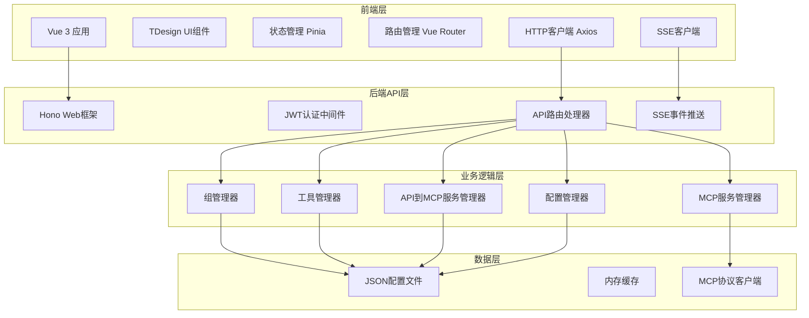

# Web界面开发设计文档

## 概述

本设计文档详细描述了MCP Hub Web管理界面的架构设计、组件结构、API接口和数据模型。系统采用前后端分离架构，前端使用Vue 3 + TDesign Vue Next构建，后端基于现有的Hono框架扩展，集成JWT认证和实时通信功能。

## 架构设计

### 整体架构



### 前端架构

#### 目录结构
```
frontend/src/
├── components/          # 通用组件
│   ├── layout/         # 布局组件
│   ├── forms/          # 表单组件
│   ├── charts/         # 图表组件
│   └── common/         # 通用UI组件
├── views/              # 页面组件
│   ├── auth/           # 认证相关页面
│   ├── dashboard/      # 仪表板
│   ├── servers/        # 服务器管理
│   ├── tools/          # 工具管理
│   ├── groups/         # 组管理
│   ├── api-to-mcp/     # API到MCP管理
│   ├── debug/          # 调试工具
│   └── settings/       # 系统配置
├── stores/             # Pinia状态管理
├── services/           # API服务层
├── utils/              # 工具函数
├── types/              # TypeScript类型定义
└── router/             # 路由配置
```

#### 技术栈
- **Vue 3** - 响应式前端框架
- **TDesign Vue Next** - 企业级UI组件库
- **Pinia** - 状态管理
- **Vue Router** - 路由管理
- **Axios** - HTTP客户端
- **TypeScript** - 类型安全
- **Vite** - 构建工具

### 后端架构扩展

#### 新增API路由结构
```
backend/src/api/
├── auth/               # 认证相关API
│   ├── login.ts
│   ├── logout.ts
│   └── refresh.ts
├── dashboard/          # 仪表板API
│   └── stats.ts
├── servers/            # 服务器管理API
│   └── index.ts
├── tools/              # 工具管理API
│   └── index.ts
├── groups/             # 组管理API (已存在，需扩展)
│   └── index.ts
├── api-to-mcp/         # API到MCP管理API
│   └── index.ts
├── debug/              # 调试工具API
│   └── index.ts
└── config/             # 配置管理API
    └── index.ts
```

## 组件和接口设计

### 前端核心组件

#### 1. 布局组件

**MainLayout.vue**
```vue
<template>
  <t-layout>
    <t-header>
      <AppHeader />
    </t-header>
    <t-layout>
      <t-aside>
        <SideNavigation />
      </t-aside>
      <t-content>
        <router-view />
      </t-content>
    </t-layout>
  </t-layout>
</template>
```

**功能特性:**
- 响应式布局适配
- 侧边栏折叠/展开
- 面包屑导航
- 用户信息显示
- 退出登录功能

#### 2. 认证组件

**LoginForm.vue**
```vue
<template>
  <t-form @submit="handleLogin">
    <t-form-item label="用户名">
      <t-input v-model="form.username" />
    </t-form-item>
    <t-form-item label="密码">
      <t-input type="password" v-model="form.password" />
    </t-form-item>
    <t-button type="submit">登录</t-button>
  </t-form>
</template>
```

#### 3. 服务器管理组件

**ServerList.vue**
- 服务器列表展示
- 实时状态更新
- 连接/断开操作
- 服务器配置编辑

**ServerForm.vue**
- 服务器配置表单
- 参数验证
- 连接测试功能

#### 4. 工具管理组件

**ToolList.vue**
- 工具列表展示
- 按服务器分组
- 工具详情查看
- 工具测试功能

**ToolTester.vue**
- 交互式工具测试
- 参数输入表单
- 结果展示
- 历史记录

#### 5. API到MCP管理组件

**ApiConfigList.vue**
- API配置列表
- 配置状态显示
- 快速操作按钮

**ApiConfigForm.vue**
- API配置表单
- 参数映射编辑器
- 测试功能集成

**ParameterMapper.vue**
- 可视化参数映射
- 拖拽式配置
- 实时预览

### 后端API接口设计

#### 1. 认证API

```typescript
// POST /api/auth/login
interface LoginRequest {
  username: string;
  password: string;
}

interface LoginResponse {
  token: string;
  refreshToken: string;
  user: {
    id: string;
    username: string;
    role: string;
  };
}

// POST /api/auth/refresh
interface RefreshRequest {
  refreshToken: string;
}

interface RefreshResponse {
  token: string;
}
```

#### 2. 服务器管理API

```typescript
// GET /api/servers
interface ServerListResponse {
  servers: ServerInfo[];
}

interface ServerInfo {
  id: string;
  name: string;
  type: 'stdio' | 'sse' | 'websocket';
  status: 'connected' | 'disconnected' | 'connecting' | 'error';
  config: ServerConfig;
  tools: ToolInfo[];
  lastConnected?: string;
  lastError?: string;
}

// POST /api/servers
interface CreateServerRequest {
  id: string;
  config: ServerConfig;
}

// PUT /api/servers/:id
interface UpdateServerRequest {
  config: ServerConfig;
}

// POST /api/servers/:id/connect
// POST /api/servers/:id/disconnect
// DELETE /api/servers/:id
```

#### 3. 工具管理API

```typescript
// GET /api/tools
interface ToolListResponse {
  tools: ToolInfo[];
}

interface ToolInfo {
  name: string;
  description: string;
  serverId: string;
  serverName: string;
  inputSchema: JsonSchema;
  status: 'available' | 'unavailable';
}

// POST /api/tools/:toolName/execute
interface ToolExecuteRequest {
  serverId?: string;
  groupId?: string;
  arguments: Record<string, unknown>;
}

interface ToolExecuteResponse {
  success: boolean;
  result?: ToolResult;
  error?: string;
}
```

#### 4. 组管理API (扩展现有)

```typescript
// GET /api/groups
interface GroupListResponse {
  groups: GroupInfo[];
}

interface GroupInfo {
  id: string;
  name: string;
  description?: string;
  servers: string[];
  tools: string[];
  stats: {
    totalServers: number;
    availableServers: number;
    totalTools: number;
  };
}

// POST /api/groups
interface CreateGroupRequest {
  id: string;
  name: string;
  description?: string;
  servers: string[];
  tools: string[];
}

// PUT /api/groups/:id
// DELETE /api/groups/:id
```

#### 5. API到MCP管理API

```typescript
// GET /api/api-to-mcp/configs
interface ApiConfigListResponse {
  configs: ApiConfigInfo[];
}

interface ApiConfigInfo {
  id: string;
  name: string;
  description: string;
  status: 'active' | 'inactive' | 'error';
  api: {
    url: string;
    method: string;
  };
  toolsGenerated: number;
  lastUpdated: string;
}

// POST /api/api-to-mcp/configs
interface CreateApiConfigRequest {
  config: ApiToolConfig;
}

// PUT /api/api-to-mcp/configs/:id
// DELETE /api/api-to-mcp/configs/:id

// POST /api/api-to-mcp/configs/:id/test
interface TestApiConfigRequest {
  parameters: Record<string, unknown>;
}

interface TestApiConfigResponse {
  success: boolean;
  response?: unknown;
  error?: string;
  executionTime: number;
}
```

#### 6. 调试工具API

```typescript
// GET /api/debug/mcp-messages
interface McpMessageListResponse {
  messages: McpMessage[];
}

interface McpMessage {
  id: string;
  timestamp: string;
  serverId: string;
  type: 'request' | 'response' | 'notification';
  method: string;
  content: unknown;
}

// POST /api/debug/tool-test
interface ToolTestRequest {
  toolName: string;
  serverId?: string;
  groupId?: string;
  arguments: Record<string, unknown>;
}

// GET /api/debug/performance-stats
interface PerformanceStatsResponse {
  stats: {
    totalRequests: number;
    averageResponseTime: number;
    errorRate: number;
    topTools: Array<{
      name: string;
      calls: number;
      avgTime: number;
    }>;
  };
}
```

#### 7. 仪表板API

```typescript
// GET /api/dashboard/stats
interface DashboardStatsResponse {
  overview: {
    totalServers: number;
    connectedServers: number;
    totalTools: number;
    totalGroups: number;
  };
  recentActivity: Activity[];
  systemHealth: {
    status: 'healthy' | 'warning' | 'error';
    issues: string[];
  };
}

interface Activity {
  id: string;
  type: 'server_connected' | 'server_disconnected' | 'tool_executed' | 'error';
  message: string;
  timestamp: string;
  severity: 'info' | 'warning' | 'error';
}
```

#### 8. SSE事件推送

```typescript
// GET /api/events (SSE endpoint)
interface SSEEvent {
  type: 'server_status' | 'tool_execution' | 'system_alert';
  data: unknown;
  timestamp: string;
}

// 服务器状态变更事件
interface ServerStatusEvent {
  type: 'server_status';
  data: {
    serverId: string;
    status: ServerStatus;
    error?: string;
  };
}

// 工具执行事件
interface ToolExecutionEvent {
  type: 'tool_execution';
  data: {
    toolName: string;
    serverId: string;
    success: boolean;
    executionTime: number;
  };
}
```

## 数据模型

### 前端状态管理

#### 认证状态 (AuthStore)
```typescript
interface AuthState {
  isAuthenticated: boolean;
  user: User | null;
  token: string | null;
  refreshToken: string | null;
}

interface User {
  id: string;
  username: string;
  role: string;
}
```

#### 服务器状态 (ServerStore)
```typescript
interface ServerState {
  servers: Map<string, ServerInfo>;
  loading: boolean;
  error: string | null;
}
```

#### 工具状态 (ToolStore)
```typescript
interface ToolState {
  tools: Map<string, ToolInfo>;
  toolsByServer: Map<string, ToolInfo[]>;
  executionHistory: ToolExecution[];
  loading: boolean;
}

interface ToolExecution {
  id: string;
  toolName: string;
  serverId: string;
  arguments: Record<string, unknown>;
  result: ToolResult;
  timestamp: string;
  executionTime: number;
}
```

#### 组状态 (GroupStore)
```typescript
interface GroupState {
  groups: Map<string, GroupInfo>;
  loading: boolean;
  error: string | null;
}
```

#### API到MCP状态 (ApiToMcpStore)
```typescript
interface ApiToMcpState {
  configs: Map<string, ApiConfigInfo>;
  loading: boolean;
  testResults: Map<string, TestResult>;
}

interface TestResult {
  configId: string;
  success: boolean;
  response?: unknown;
  error?: string;
  timestamp: string;
}
```

### 后端数据扩展

#### JWT认证配置
```typescript
interface JwtConfig {
  secret: string;
  expiresIn: string;
  refreshExpiresIn: string;
  issuer: string;
}

interface UserCredentials {
  username: string;
  passwordHash: string;
  role: string;
  createdAt: string;
  lastLogin?: string;
}
```

#### 系统配置扩展
```typescript
interface SystemConfig {
  server: {
    port: number;
    host: string;
  };
  auth: JwtConfig;
  ui: {
    title: string;
    theme: string;
    features: {
      apiToMcp: boolean;
      debugging: boolean;
      monitoring: boolean;
    };
  };
  monitoring: {
    metricsEnabled: boolean;
    logLevel: string;
    retentionDays: number;
  };
}
```

## 错误处理

### 前端错误处理策略

1. **HTTP错误处理**
   - 401: 自动跳转登录页
   - 403: 显示权限不足提示
   - 500: 显示系统错误页面
   - 网络错误: 显示重试选项

2. **表单验证错误**
   - 实时验证反馈
   - 错误信息本地化
   - 字段级错误提示

3. **业务逻辑错误**
   - Toast消息提示
   - 详细错误信息展示
   - 操作回滚机制

### 后端错误处理

1. **标准化错误响应**
```typescript
interface ErrorResponse {
  success: false;
  error: {
    code: string;
    message: string;
    details?: unknown;
  };
  timestamp: string;
  path: string;
}
```

2. **错误分类**
   - 认证错误 (AUTH_*)
   - 验证错误 (VALIDATION_*)
   - 业务逻辑错误 (BUSINESS_*)
   - 系统错误 (SYSTEM_*)

## 测试策略

### 前端测试

1. **单元测试**
   - 组件逻辑测试
   - 状态管理测试
   - 工具函数测试

2. **集成测试**
   - API服务测试
   - 路由测试
   - 端到端流程测试

3. **UI测试**
   - 组件渲染测试
   - 用户交互测试
   - 响应式布局测试

### 后端测试

1. **API测试**
   - 端点功能测试
   - 认证授权测试
   - 错误处理测试

2. **集成测试**
   - MCP协议集成测试
   - 数据库操作测试
   - 外部API调用测试

3. **性能测试**
   - 并发请求测试
   - 内存使用测试
   - 响应时间测试

## 安全考虑

### 认证和授权

1. **JWT Token安全**
   - 短期访问token
   - 长期刷新token
   - Token自动刷新机制

2. **密码安全**
   - bcrypt哈希加密
   - 密码强度验证
   - 登录失败限制

3. **API安全**
   - 请求频率限制
   - 输入参数验证
   - SQL注入防护

### 数据安全

1. **敏感数据保护**
   - 配置文件加密
   - 环境变量管理
   - 日志脱敏处理

2. **通信安全**
   - HTTPS强制使用
   - CORS配置
   - CSP头部设置

## 性能优化

### 前端优化

1. **代码分割**
   - 路由级别懒加载
   - 组件按需导入
   - 第三方库分离

2. **缓存策略**
   - HTTP缓存配置
   - 本地存储使用
   - 状态持久化

3. **渲染优化**
   - 虚拟滚动
   - 防抖节流
   - 组件复用

### 后端优化

1. **响应优化**
   - 数据压缩
   - 分页查询
   - 字段选择

2. **缓存机制**
   - 内存缓存
   - 查询结果缓存
   - 静态资源缓存

3. **并发处理**
   - 连接池管理
   - 异步处理
   - 队列机制